# Configuración de Oracle Free Tier

## 🎯 **Objetivo**

Guía paso a paso para crear una cuenta Free Tier en Oracle Cloud.

### **Recursos y soporte**:
- **Documentación de Oracle Cloud**: [Documentación de Oracle Cloud](https://docs.oracle.com/en/cloud/)
- **Tutoriales**: Explore el [Centro de aprendizaje de Oracle](https://mylearn.oracle.com/ou/home)

## 📌 Introducción

> Este documento de configuración le guiará en la **creación de una cuenta Oracle Cloud Free Tier**, necesaria para realizar cualquier laboratorio técnico en Oracle Cloud Infrastructure (OCI).

### ➡️ **¿Qué es Oracle Cloud?**

 [**Oracle Cloud**](https://www.oracle.com/br/cloud/) es una plataforma de infraestructura y servicios en la nube que ofrece una amplia gama de capacidades para soluciones de negocio, aplicaciones y desarrollo. Con OCI puede aprovechar recursos de cómputo, almacenamiento, bases de datos e inteligencia artificial, entre otros, en un entorno seguro y de alto rendimiento.

<br>
### ➡️ **¿Cómo funciona Oracle Cloud Free Tier?**

Oracle Cloud Free Tier es una cuenta gratuita que ofrece acceso sin costo a diversos servicios de Oracle Cloud, con [**USD 500**](https://www.oracle.com/cloud/free/) en créditos promocionales válidos durante **30 días**, además de servicios gratuitos. Incluye, entre otros, cómputo, almacenamiento, bases de datos y servicios de inteligencia artificial.

El objetivo principal de Oracle Free Tier es **permitirle probar y desarrollar soluciones en Oracle Cloud sin un costo inicial.** Es una excelente oportunidad para probar la infraestructura y los servicios avanzados de OCI, y familiarizarse con las capacidades disponibles.

<br>
### **Recursos y soporte**:

- **Documentación de Oracle Cloud**: [Documentación de Oracle Cloud](https://docs.oracle.com/en/cloud/)
- **Tutoriales**: Explore el [Centro de aprendizaje de Oracle](https://mylearn.oracle.com/ou/home)


### _**Disfrute su experiencia en Oracle Cloud.**_


## 1️⃣ Creacion de Oracle Free Tier

Visite [www.oracle.com/cloud/free](https://www.oracle.com/cloud/free/) y haga clic en **"Start for Free"**.

   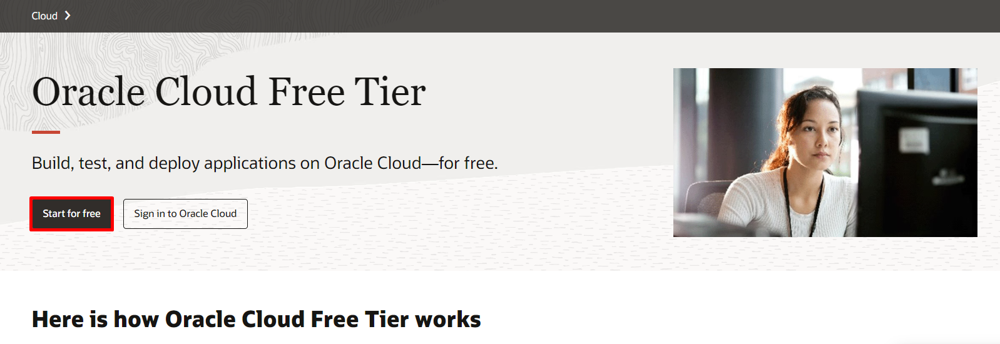


<aside class="workshop-alert" role="note" aria-label="Atención">
  <svg class="workshop-alert-icon" viewBox="0 0 24 24" fill="none" aria-hidden="true" focusable="false">
    <path fill-rule="evenodd" clip-rule="evenodd" d="M11 13C11 13.5523 11.4477 14 12 14C12.5523 14 13 13.5523 13 13V10C13 9.44772 12.5523 9 12 9C11.4477 9 11 9.44772 11 10V13ZM13 15.9888C13 15.4365 12.5523 14.9888 12 14.9888C11.4477 14.9888 11 15.4365 11 15.9888V16C11 16.5523 11.4477 17 12 17C12.5523 17 13 16.5523 13 16V15.9888ZM9.37735 4.66136C10.5204 2.60393 13.4793 2.60393 14.6223 4.66136L21.2233 16.5431C22.3341 18.5427 20.8882 21 18.6008 21H5.39885C3.11139 21 1.66549 18.5427 2.77637 16.5431L9.37735 4.66136Z" fill="currentColor" />
  </svg>
  <div class="workshop-alert-copy">
    <strong>Atención.</strong>
    <p>Use el correo electrónico registrado para el evento durante el proceso de creación de la cuenta Free Trial.</p>
  </div>
</aside>

Complete la información de **Country, First Name, Last Name y Email**. A continuación, haga clic en **Verify my Email**.

   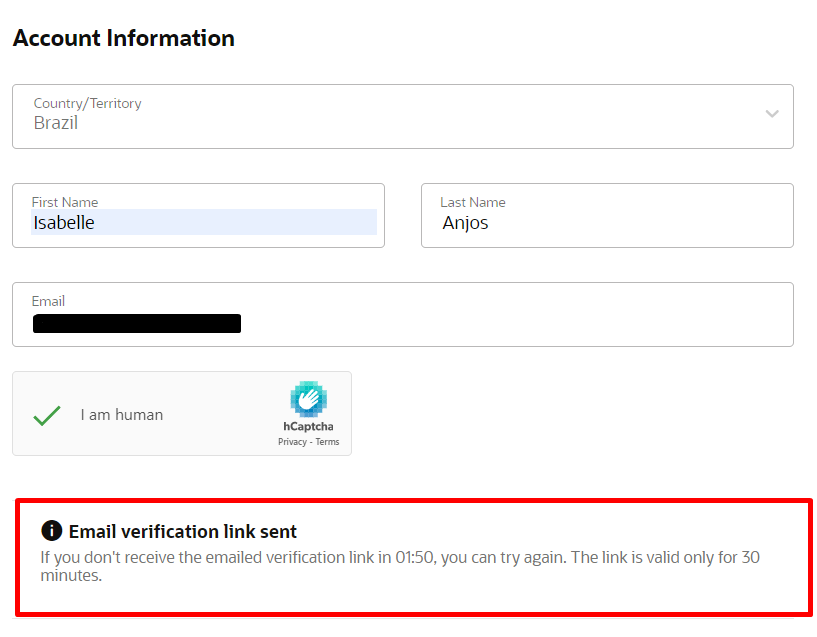

Al hacer clic en Verify my Email, aparecerá el siguiente mensaje en pantalla. Seleccione **Select Offer**.

   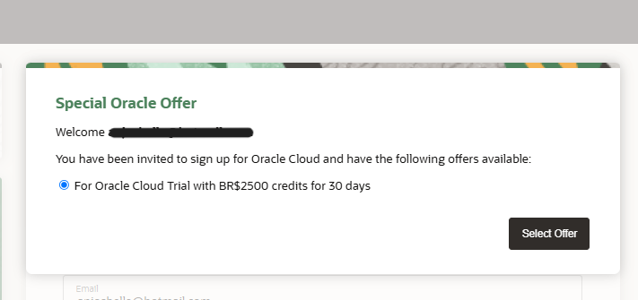

## 2️⃣ Activación de la cuenta

Recibirá un correo electrónico similar al ejemplo siguiente. **Si no lo encuentra, revise la carpeta de correo no deseado**. A continuación, haga clic en **"Verify Email"** para continuar:

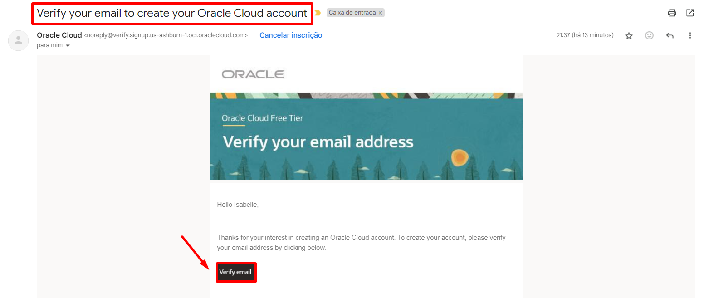

<aside class="workshop-alert" role="note" aria-label="Atención">
  <svg class="workshop-alert-icon" viewBox="0 0 24 24" fill="none" aria-hidden="true" focusable="false">
    <path fill-rule="evenodd" clip-rule="evenodd" d="M11 13C11 13.5523 11.4477 14 12 14C12.5523 14 13 13.5523 13 13V10C13 9.44772 12.5523 9 12 9C11.4477 9 11 9.44772 11 10V13ZM13 15.9888C13 15.4365 12.5523 14.9888 12 14.9888C11.4477 14.9888 11 15.4365 11 15.9888V16C11 16.5523 11.4477 17 12 17C12.5523 17 13 16.5523 13 16V15.9888ZM9.37735 4.66136C10.5204 2.60393 13.4793 2.60393 14.6223 4.66136L21.2233 16.5431C22.3341 18.5427 20.8882 21 18.6008 21H5.39885C3.11139 21 1.66549 18.5427 2.77637 16.5431L9.37735 4.66136Z" fill="currentColor" />
  </svg>
  <div class="workshop-alert-copy">
    <strong>Atención.</strong>
    <p>Complete los pasos siguientes en un plazo de <strong>30 minutos</strong> para evitar que se reinicie el enlace enviado por correo electrónico. <strong>Evite hacer clic en el enlace más de una vez</strong>, ya que puede producirse un mensaje de error.</p>
  </div>
</aside>

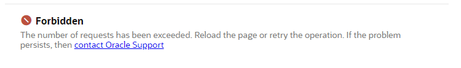

A continuación, cree una contraseña que cumpla las siguientes reglas:
   - Debe tener al menos **8 caracteres**, entre ellos **1 letra minúscula**, **1 letra mayúscula**, **1 número** y **1 carácter especial**.
   - No puede tener más de **40 caracteres**, ni incluir el **nombre**, **apellido**, **correo electrónico**, **espacios** o los caracteres: ``` ` ~ < > \ ```.

   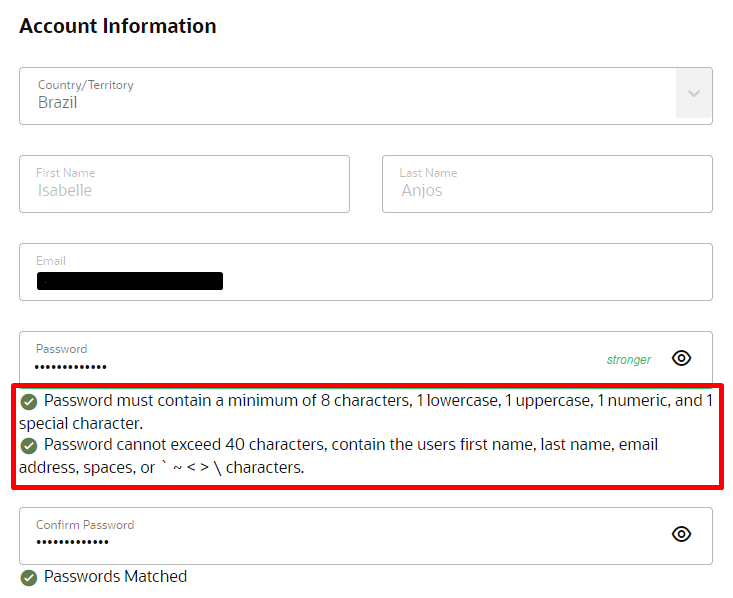

Seleccione las opciones indicadas a continuación:

- **Customer Type**:
     - Seleccione la opción **Individual**.

- **Home Region**:
    - **Seleccione la opción "Brazil East (Sao Paulo)"** como región de origen.

- **Confirmación de región**:
    - Marque la casilla para confirmar que entiende que la **región de origen** no se puede modificar después de este paso.
  
- **Términos de uso**:
    - Lea los términos de uso y haga clic en **Continue** para continuar con la configuración de la cuenta.

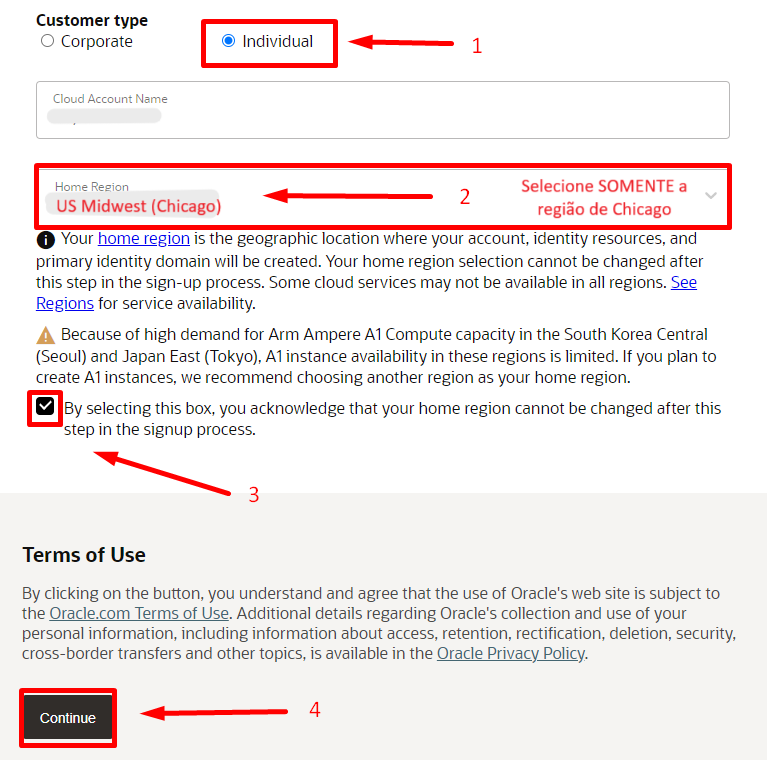

Complete la información de dirección. Cuando haya llenado todos los campos, haga clic en **Continue** para continuar.

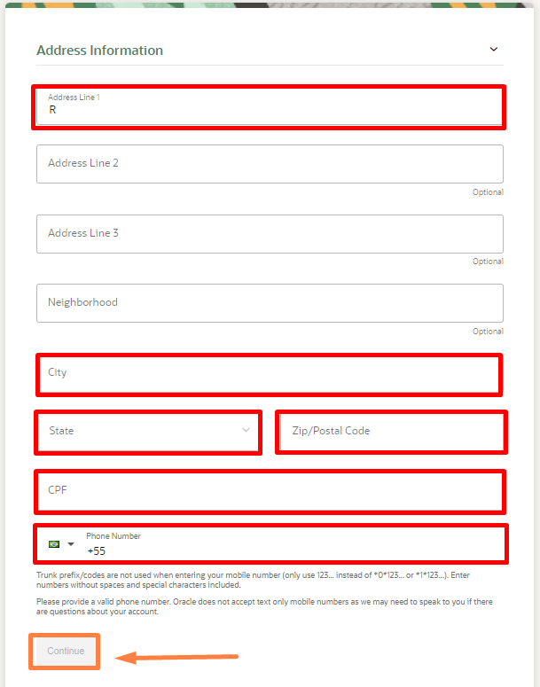


1. Marque la casilla **Agreement** para aceptar los términos.
2. Haga clic en **Start my free trial** para iniciar el período de prueba gratuito.

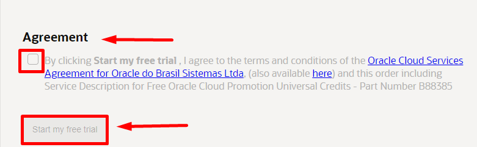

## 3️⃣ Autentificacion de dos factores

Después de iniciar el Free Trial, espere mientras Oracle configura su cuenta. Aparecerá el mensaje **"Please wait while we finish setting up your account"**. Este proceso puede tardar algunos minutos.

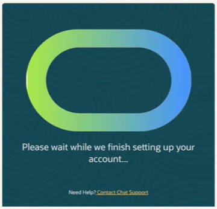

1. Recibirá un correo de confirmación de Oracle titulado **"Get Started Now with Oracle Cloud"**.
2. En ese correo, ubique **Cloud Account** y **Username**, que necesitará para acceder a su cuenta en la nube.

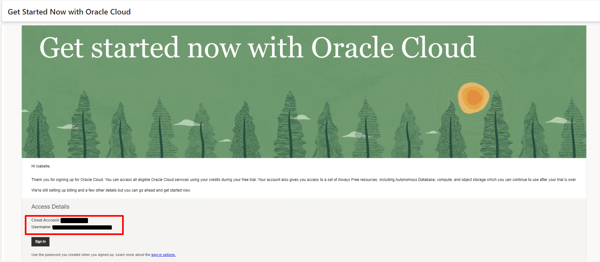

3. Acceda a la página de inicio de sesión de Oracle Cloud mediante [www.oracle.com/br/cloud/sign-in.html](https://www.oracle.com/br/cloud/sign-in.html).
4. Ingrese el **Cloud Account** proporcionado en el correo de confirmación.
5. Haga clic en **Next** y siga las instrucciones para completar el inicio de sesión.

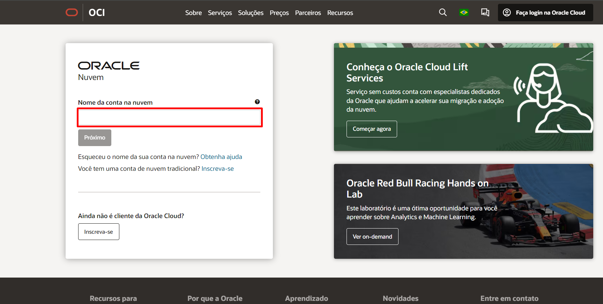

En la siguiente pantalla, haga clic en **Enable Secure Verification** para iniciar la configuración de la verificación en dos pasos.

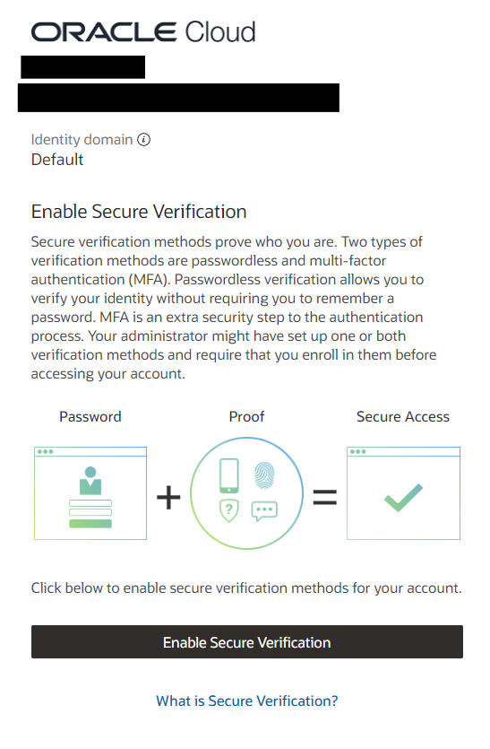

Seleccione el método de autenticación **Mobile App** y busque **Oracle Mobile Authenticator** en la tienda de aplicaciones de su teléfono.
   - [Enlace para Android](https://play.google.com/store/apps/details?id=oracle.idm.mobile.authenticator&hl=pt_BR&pli=1)
   - [Enlace para iPhone](https://apps.apple.com/br/app/oracle-mobile-authenticator/id835904829)

Configure la aplicación de autenticación:
   - Abra la aplicación en su dispositivo móvil.
   - Toque **Add Account o +** y escanee el código QR que aparece en pantalla para vincular la aplicación con su cuenta.

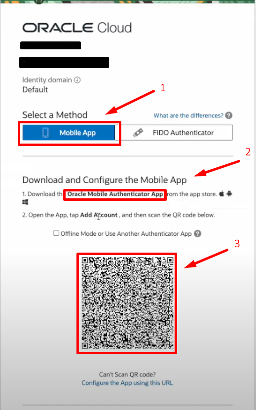

Complete el proceso de configuración:
   - Cuando la aplicación se vincule, verá en pantalla el mensaje de confirmación **Successfully Enrolled**.
   - Haga clic en **Done** para terminar el proceso.

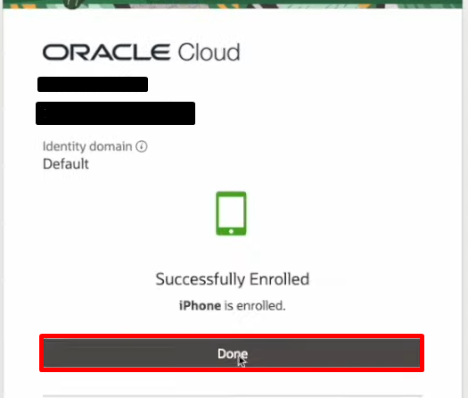

## 4️⃣ Acceso a la cuenta

Después de configurar los dos factores, accederá a la pantalla de inicio de sesión. Ingrese el **correo electrónico** y la **contraseña** registrados; luego haga clic en **Sign In** para continuar.

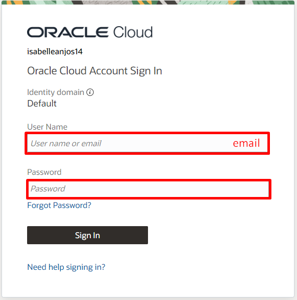

Recibirá una **notificación** en el dispositivo configurado con **Oracle Mobile Authenticator**. Ábrala y toque **Allow** para continuar el inicio de sesión.

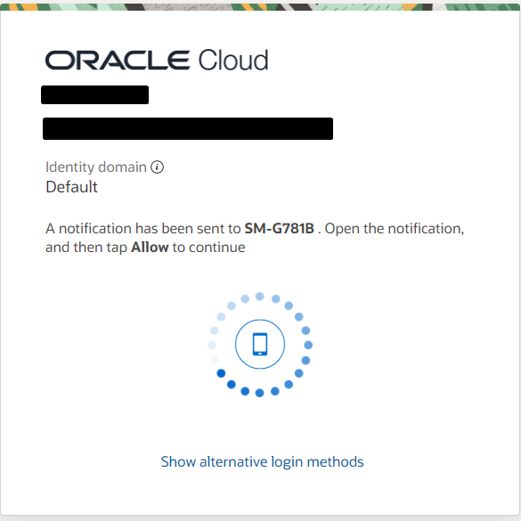

Después de iniciar sesión, será redirigido a la consola de Oracle Cloud.
  - Verifique que la **región seleccionada** en la esquina superior derecha sea "US Midwest (Chicago)".
  - En la consola puede consultar sus créditos restantes y acceder a los enlaces de los servicios.

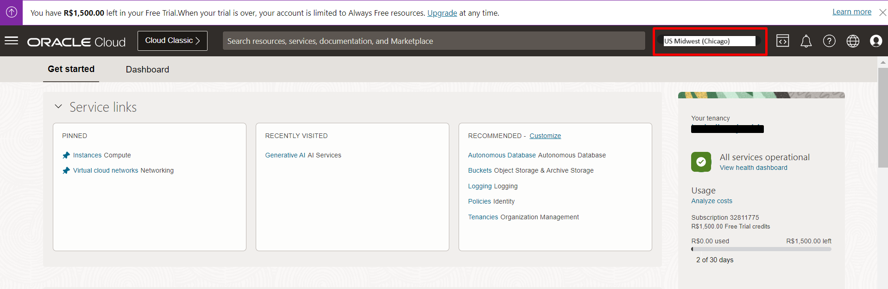


## 5️⃣ Resumen

Con la cuenta Oracle Cloud Free Tier configurada, ya puede continuar con cualquier laboratorio técnico de OCI. **Aproveche al máximo sus créditos gratuitos para descubrir todo lo que Oracle Cloud tiene para ofrecer.**

## 👥 Agradecimientos

- **Autor** - Caio Oliveira
- **Autora colaboradora** - Isabelle Anjos
- **Última actualización** - Agosto de 2026

## 🛡️ Safe Harbor

El tutorial presentado tiene por objeto describir la dirección general de nuestros productos. Se ofrece únicamente con fines informativos y no puede incorporarse a un contrato. No constituye un compromiso de entrega de ningún material, código o funcionalidad, ni debe considerarse para decisiones de compra. El desarrollo, lanzamiento, fecha de disponibilidad y precio de las funcionalidades o recursos de los productos Oracle descritos están sujetos a cambios y son de exclusiva discreción de Oracle Corporation.

Esta es una traducción de cortesía de una presentación en inglés preparada para la sede de Oracle en Estados Unidos, por lo que puede contener errores. Los recursos y funcionalidades podrían no estar disponibles en todos los países e idiomas. Ante cualquier duda, contacte a su representante de ventas de Oracle.


