# OCI AI Data Platform

## 🎯 **Objetivos**

Descubrir cómo utilizar en la práctica OCI AI Data Platform para crear un pipeline de extremo a extremo: importar y trabajar con archivos CSV, realizar transformaciones, crear la arquitectura Medallón, crear agents y publicar los resultados finales en Autonomous Database.

Aprenderá a:

- Preparar la infraestructura de OCI AI Data Platform.
- Crear un catálogo, volumen, workspace y clúster Spark.
- Cargar un conjunto de datos CSV en AIDP.
- Realizar controles de calidad y análisis exploratorio de datos.
- Crear las capas de la arquitectura Medallón con PySpark.
- Replicar conjuntos de datos procesados en Autonomous Database.
- Orquestar notebooks en secuencia mediante un Workflow.
- Crear y configurar agents.

### _**Disfrute su experiencia en Oracle Cloud.**_

## 📌 Introducción

> **El laboratorio implementa un pipeline de datos por capas. El procesamiento se realiza en OCI AI Data Platform con notebooks y Spark. En este workshop trabajaremos con un conjunto de datos CSV, procesaremos los datos mediante AIDP y, finalmente, los publicaremos en Autonomous Database en OCI; además, crearemos un agent sencillo.**

# **Parte 1 - Práctica guiada de AI Data Platform**

## **1️⃣ Preparación de la infraestructura**

Antes de iniciar la práctica guiada, prepare los recursos necesarios:

1.  Cree **una instancia de AI Data Platform**.


Asigne un nombre a su instancia y a su workspace, y elija las políticas predeterminadas. No es necesario completar la sección de Autonomous AI Lakehouse.


> **⚠️ ATENCIÓN:** La creación de la instancia de AIDP puede tardar aproximadamente 10 minutos.

2.  Cree **un Autonomous Database**

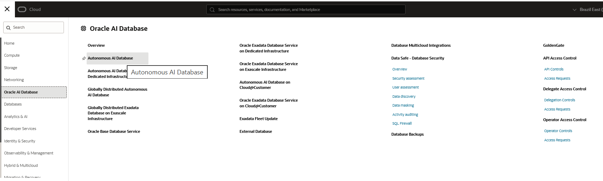

Cree un Autonomous Database con las siguientes configuraciones.

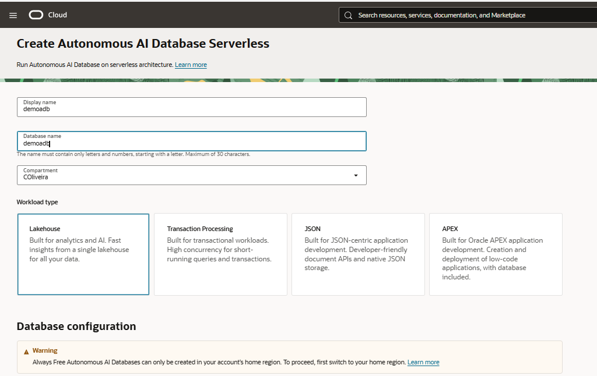

> **⚠️ ATENCIÓN:** Asegúrese de que la versión de Autonomous Database sea 26ai.

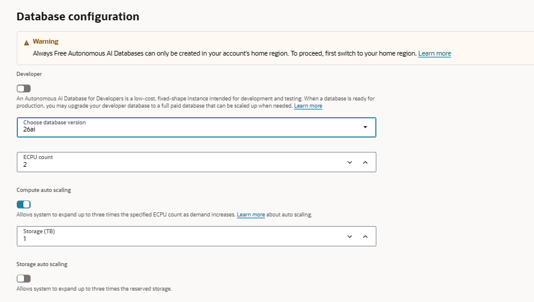

> **⚠️ ATENCIÓN:** Se sugiere utilizar la contraseña **WORKSHOPsec2019##**; no obstante, puede elegir otra. Puede mantener el resto de las configuraciones predeterminadas y, después, hacer clic en **Create**.


> **⚠️ ATENCIÓN:** La creación de la instancia de Autonomous Database puede tardar aproximadamente 5 minutos.

3.  Regrese a la instancia de AIDP y cree **un catálogo Standard**.

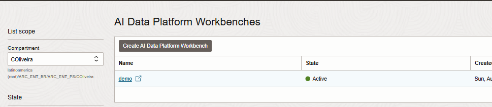

Haga clic en **Master Catalog** y luego en **Create Catalog**. Asigne el nombre **demo** al catálogo y haga clic en **Create**.


4.  Seleccione el catálogo demo y el esquema default; luego, elija volumes y cree **un volumen virtual Standard** con el botón + (junto al campo de filtro). Asígnele el nombre vol01.


5.  Ahora, en el panel izquierdo, haga clic en workspace y cree **un Workspace** con el botón + (junto al campo de filtro). Asígnele el nombre workspace01.

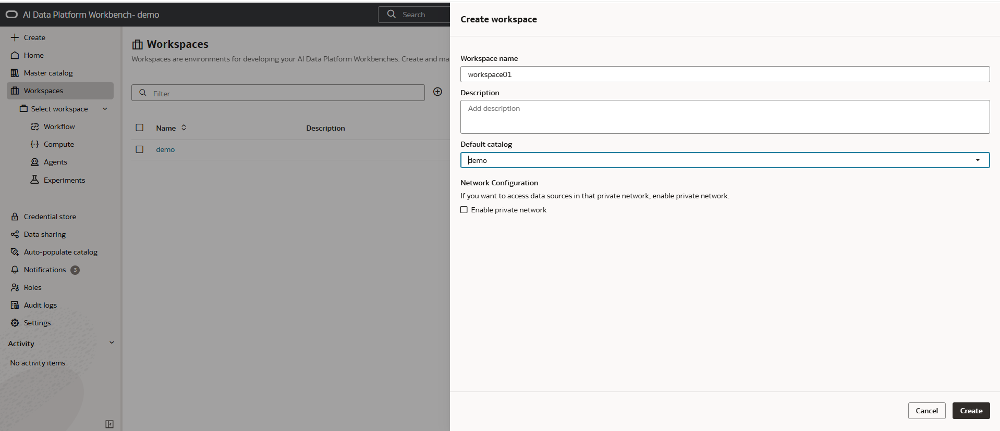

6.  Cuando termine de crear el workspace, selecciónelo y, en el panel izquierdo, elija compute. Cree **un clúster Spark** con el botón + (junto al campo de filtro). Asígnele el nombre spark01.


7.  Integre Autonomous Database con AIDP mediante la pestaña Master Catalog.

Haga clic en create catalog y elija el tipo external.

En la pantalla de detalles de Autonomous Database, haga clic en **Database Connection** y descargue su wallet.

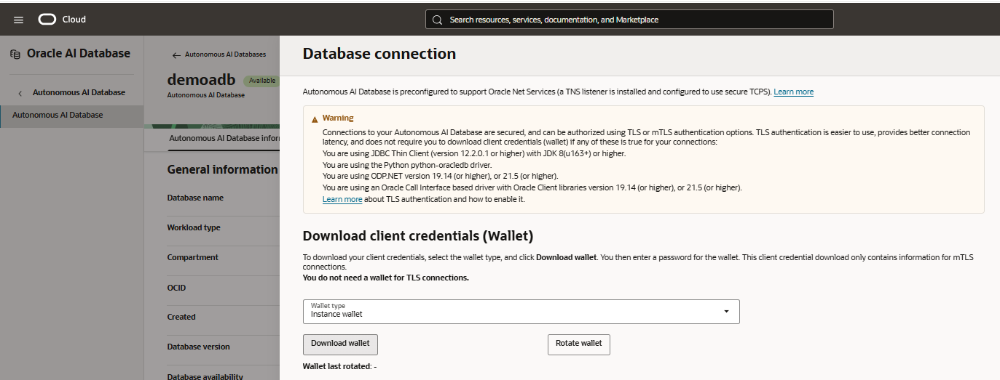

> **⚠️ ATENCIÓN:** Se sugiere utilizar la contraseña **WORKSHOPsec2019##**; no obstante, puede elegir otra si lo prefiere.

Asigne el nombre **adb01** al catálogo, cargue la wallet en el formulario de AIDP, elija el servicio **Medium** y complete los demás datos como se muestra en la captura.

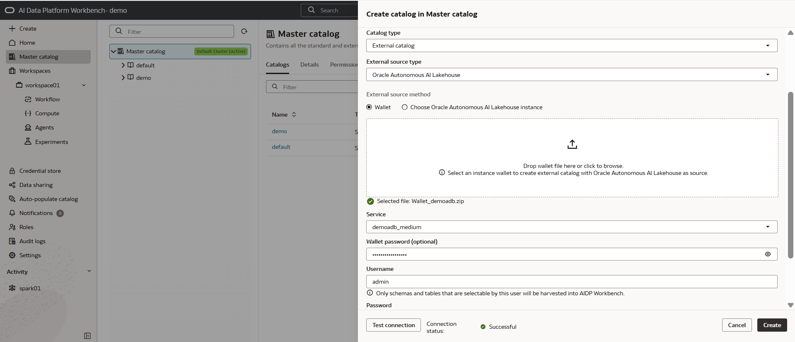

8.  Inicie la práctica guiada.

## **2️⃣ Creación de la capa Bronze**

En el panel izquierdo, haga clic en workspace01 y cree un notebook con el botón + (junto al campo de filtro). El primer paso consiste en descargar los archivos `orders.csv` y `customers.csv`, cargarlos con Spark y conservar los datos como tablas Delta en la capa Bronze.

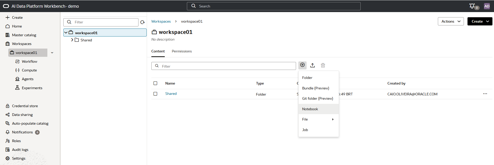

Cambie el nombre del notebook a **notebook_bronze** (haga clic en el **lápiz**, modifique el nombre y presione **Enter**) y pegue el siguiente código en la celda. Después, presione **Ctrl + S** para guardarlo.

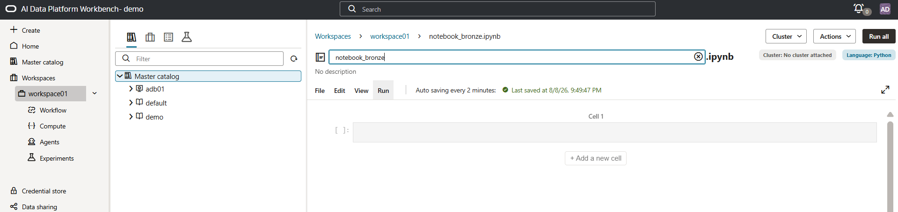

``` python
import os
import urllib.request

orders_url = "https://raw.githubusercontent.com/caiogusto2/workshop-dataplatform/main/aidataplatform/arquivos_csv/orders.csv"
customers_url = "https://raw.githubusercontent.com/caiogusto2/workshop-dataplatform/main/aidataplatform/arquivos_csv/customers.csv"
politica_trocas_url = "https://raw.githubusercontent.com/caiogusto2/workshop-dataplatform/main/aidataplatform/arquivos_rag/politica_trocas.pdf"

# Substitua pelo caminho do volume criado no catálogo
tmp_dir = "/Volumes/demo/default/vol01"
os.makedirs(tmp_dir, exist_ok=True)

orders_file = os.path.join(tmp_dir, "orders.csv")
customers_file = os.path.join(tmp_dir, "customers.csv")
politica_trocas_file = os.path.join(tmp_dir, "politica_trocas.pdf")

urllib.request.urlretrieve(orders_url, orders_file)
urllib.request.urlretrieve(customers_url, customers_file)
urllib.request.urlretrieve(politica_trocas_url, politica_trocas_file)

df_orders = (
    spark.read
    .option("header", "true")
    .option("inferSchema", "true")
    .option("sep", ";")
    .csv(orders_file)
)

df_customers = (
    spark.read
    .option("header", "true")
    .option("inferSchema", "true")
    .option("sep", ";")
    .csv(customers_file)
)

spark.sql("CREATE CATALOG IF NOT EXISTS demo")
spark.sql("CREATE SCHEMA IF NOT EXISTS demo.bronze")

(
    df_orders.write
    .mode("overwrite")
    .option("overwriteSchema", "true")
    .saveAsTable("demo.bronze.orders")
)

(
    df_customers.write
    .mode("overwrite")
    .option("overwriteSchema", "true")
    .saveAsTable("demo.bronze.customers")
)

print("Created Delta tables:")
print("demo.bronze.orders")
print("demo.bronze.customers")
```

Para ejecutar el notebook, adjunte un clúster Spark y haga clic en run all.


Si la ejecución es correcta, verá el siguiente registro en pantalla.

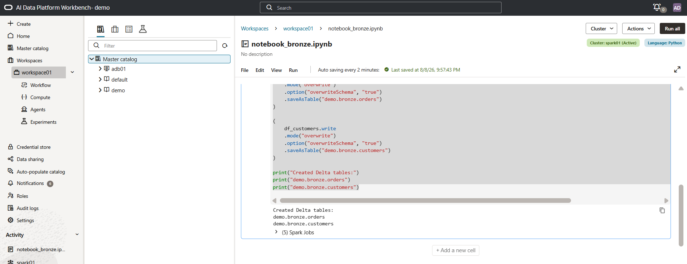

### **➡️ Análisis exploratorio de la capa Bronze**

Después de la carga, haga clic en **+ Add a new cell** (debajo del párrafo existente en el notebook) para agregar una celda y comprobar la estructura, las muestras, los valores nulos, las estadísticas y los duplicados.

Copie y pegue el siguiente código en una nueva celda del notebook; luego presione **Ctrl + Enter** para ejecutar solo esa celda.

``` python
print("=== DESCRIBE TABLE: demo.bronze.orders ===")
spark.sql("DESCRIBE TABLE demo.bronze.orders").show(200, truncate=False)

print("=== DESCRIBE TABLE: demo.bronze.customers ===")
spark.sql("DESCRIBE TABLE demo.bronze.customers").show(200, truncate=False)

spark.sql("SELECT * FROM demo.bronze.orders LIMIT 10").show(10, truncate=False)
spark.sql("SELECT * FROM demo.bronze.customers LIMIT 10").show(10, truncate=False)

spark.sql("""
SELECT
  COUNT(*) AS row_count,
  SUM(CASE WHEN CUSTOMER_ID IS NULL THEN 1 ELSE 0 END) AS customer_id_nulls,
  SUM(CASE WHEN ORDER_ID IS NULL THEN 1 ELSE 0 END) AS order_id_nulls,
  SUM(CASE WHEN ORDER_DATE IS NULL THEN 1 ELSE 0 END) AS order_date_nulls,
  SUM(CASE WHEN ORDER_TOTAL IS NULL THEN 1 ELSE 0 END) AS order_total_nulls,
  SUM(CASE WHEN COST_OF_DELIVERY IS NULL THEN 1 ELSE 0 END) AS cost_of_delivery_nulls,
  MIN(ORDER_TOTAL) AS min_order_total,
  MAX(ORDER_TOTAL) AS max_order_total,
  AVG(ORDER_TOTAL) AS avg_order_total,
  MIN(COST_OF_DELIVERY) AS min_cost_of_delivery,
  MAX(COST_OF_DELIVERY) AS max_cost_of_delivery,
  AVG(COST_OF_DELIVERY) AS avg_cost_of_delivery
FROM demo.bronze.orders
""").show(truncate=False)

spark.sql("""
SELECT
  COUNT(*) AS row_count,
  SUM(CASE WHEN CUSTOMER_ID IS NULL THEN 1 ELSE 0 END) AS customer_id_nulls,
  SUM(CASE WHEN CUST_FIRST_NAME IS NULL THEN 1 ELSE 0 END) AS cust_first_name_nulls,
  SUM(CASE WHEN CUST_LAST_NAME IS NULL THEN 1 ELSE 0 END) AS cust_last_name_nulls,
  SUM(CASE WHEN CUST_EMAIL IS NULL THEN 1 ELSE 0 END) AS cust_email_nulls,
  SUM(CASE WHEN CREDIT_LIMIT IS NULL THEN 1 ELSE 0 END) AS credit_limit_nulls,
  MIN(CREDIT_LIMIT) AS min_credit_limit,
  MAX(CREDIT_LIMIT) AS max_credit_limit,
  AVG(CREDIT_LIMIT) AS avg_credit_limit
FROM demo.bronze.customers
""").show(truncate=False)

spark.sql("""
SELECT CUSTOMER_ID, ORDER_ID, COUNT(*) AS cnt
FROM demo.bronze.orders
GROUP BY CUSTOMER_ID, ORDER_ID
HAVING COUNT(*) > 1
ORDER BY cnt DESC
""").show(truncate=False)

spark.sql("""
SELECT CUSTOMER_ID, COUNT(*) AS cnt
FROM demo.bronze.customers
GROUP BY CUSTOMER_ID
HAVING COUNT(*) > 1
ORDER BY cnt DESC
""").show(truncate=False)
```

Si la ejecución es correcta, aparecerán los siguientes resultados con el análisis de los datos recién importados.
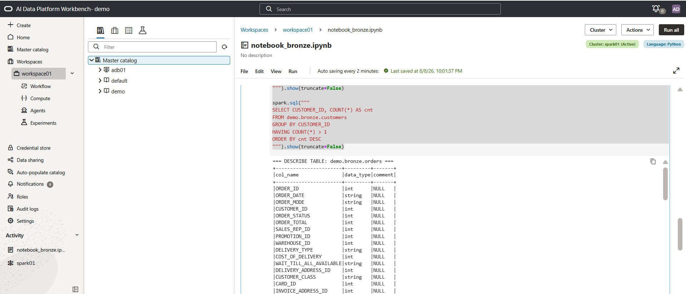

## **3️⃣ Creación de la capa Silver**

Siguiendo los pasos de la sección anterior, cree un notebook para la capa Silver y asígnele el nombre **notebook_silver**. En esta etapa, las tablas `orders` y `customers` de Bronze se combinan mediante el campo `CUSTOMER_ID`.

``` python
from pyspark.sql.functions import col

df_orders = spark.table("demo.bronze.orders")
df_customers = spark.table("demo.bronze.customers")

spark.sql("CREATE SCHEMA IF NOT EXISTS demo.silver")

df_join = (
    df_orders.alias("o")
    .join(df_customers.alias("c"), on="CUSTOMER_ID", how="inner")
)

df_silver = df_join.select(
    col("CUSTOMER_ID"), col("ORDER_ID"), col("ORDER_DATE"),
    col("ORDER_MODE"), col("ORDER_STATUS"), col("ORDER_TOTAL"),
    col("SALES_REP_ID"), col("PROMOTION_ID"), col("WAREHOUSE_ID"),
    col("DELIVERY_TYPE"), col("COST_OF_DELIVERY"),
    col("WAIT_TILL_ALL_AVAILABLE"), col("DELIVERY_ADDRESS_ID"),
    col("o.CUSTOMER_CLASS").alias("ORDER_CUSTOMER_CLASS"),
    col("CARD_ID"), col("INVOICE_ADDRESS_ID"), col("CUST_FIRST_NAME"),
    col("CUST_LAST_NAME"), col("NLS_LANGUAGE"), col("NLS_TERRITORY"),
    col("CREDIT_LIMIT"), col("CUST_EMAIL"), col("ACCOUNT_MGR_ID"),
    col("CUSTOMER_SINCE"), col("c.CUSTOMER_CLASS").alias("CUSTOMER_CLASS"),
    col("SUGGESTIONS"), col("DOB"), col("MAILSHOT"),
    col("PARTNER_MAILSHOT"), col("PREFERRED_ADDRESS"), col("PREFERRED_CARD")
)

df_silver.printSchema()
df_silver.show(10, truncate=False)

(
    df_silver.write
    .mode("overwrite")
    .option("overwriteSchema", "true")
    .saveAsTable("demo.silver.customers_orders")
)
```


### **➡️ Análisis exploratorio de Silver**

Al igual que en el notebook anterior, cree una nueva celda dentro de **notebook_silver** y pegue el contenido siguiente:
``` python
import pyspark.sql.functions as F

df_analyze = spark.table("demo.silver.customers_orders")

print(f"Rows: {df_analyze.count()}")
print(f"Columns: {len(df_analyze.columns)}")

df_analyze.select([
    F.count(F.when(F.col(c).isNull(), c)).alias(c)
    for c in df_analyze.columns
]).show(truncate=False)

(
    df_analyze.groupBy("ORDER_ID")
    .count()
    .filter(F.col("count") > 1)
    .show(truncate=False)
)

(
    df_analyze
    .agg(F.countDistinct("CUSTOMER_ID").alias("distinct_customers"))
    .show()
)

df_analyze.describe().show(truncate=False)
```


## **4️⃣ Creación de la capa Gold**

Siguiendo los pasos de la sección anterior, cree un notebook llamado **notebook_gold**. La capa Gold normaliza `CUSTOMER_CLASS` y agrega los pedidos para generar indicadores de cantidad, ventas y ticket promedio.

``` python
import pyspark.sql.functions as F

spark.sql("CREATE SCHEMA IF NOT EXISTS demo.gold")

df_silver = spark.table("demo.silver.customers_orders")

df_norm = (
    df_silver
    .withColumn(
        "CUSTOMER_CLASS_NORM",
        F.trim(
            F.regexp_replace(
                F.regexp_replace(F.upper(F.col("CUSTOMER_CLASS")), u"\u00A0", " "),
                r"\s+",
                " "
            )
        )
    )
)

df_gold = (
    df_norm
    .groupBy("CUSTOMER_CLASS_NORM")
    .agg(
        F.count("ORDER_ID").alias("total_orders"),
        F.round(F.sum("ORDER_TOTAL"), 2).alias("total_sales"),
        F.round(F.avg("ORDER_TOTAL"), 2).alias("avg_order_value")
    )
    .orderBy(F.col("total_orders").desc())
)

df_gold.show(truncate=False)

(
    df_gold.write
    .mode("overwrite")
    .option("overwriteSchema", "true")
    .saveAsTable("demo.gold.customer_class_agg_review")
)

spark.table("demo.gold.customer_class_agg_review").show(truncate=False)
```
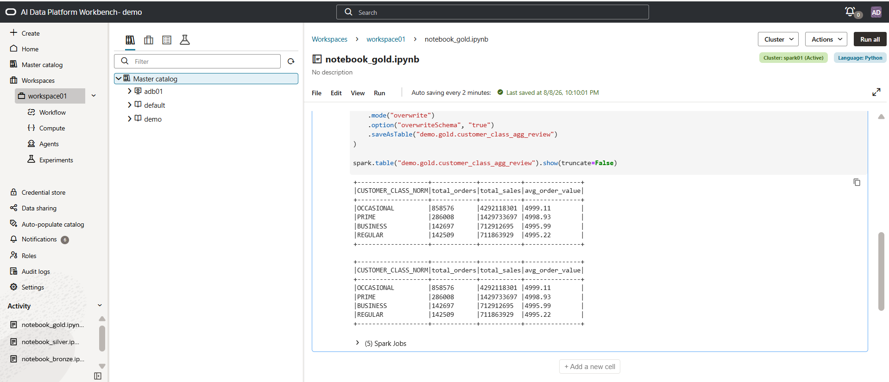

## **5️⃣ Escritura en Autonomous Database**

Por último, replicaremos y escribiremos las tablas `demo.silver.customers_orders` y `demo.gold.customer_class_agg_review` en el Autonomous Database configurado anteriormente. Puede encontrar otros ejemplos en https://github.com/oracle-samples/oracle-aidp-samples/tree/main.

Cree un notebook, asígnele el nombre **notebook_adb** y copie el siguiente código.

Ejecute el notebook para replicar los datos en el Autonomous Database que configuró con AIDP.

``` python
# ------------------------------------------------------------
# Silver
# ------------------------------------------------------------

silver_df = spark.table("demo.silver.customers_orders")

silver_df.show(10, truncate=False)

silver_df.write.saveAsTable("adb01.ADMIN.CUSTOMERS_ORDERS")

print("Silver carregada com sucesso!")


# ------------------------------------------------------------
# Gold
# ------------------------------------------------------------

gold_df = spark.table("demo.gold.customer_class_agg_review")

gold_df.show(truncate=False)

gold_df.write.saveAsTable("adb01.ADMIN.CUSTOMER_CLASS_AGG_REVIEW")

print("Gold carregada com sucesso!")
```
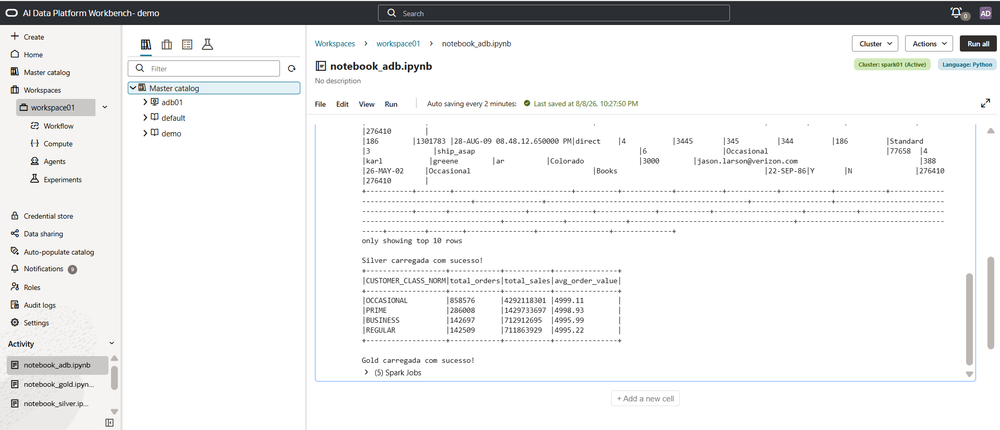

Como prueba, cree una nueva celda y consulte las tablas recién cargadas en Autonomous Database. Copie y pegue el siguiente código:

``` python
alh_df_silver = spark.read.format("aidataplatform") \
    .option("catalog.id", "adb01") \
    .option("pushdown.sql", "SELECT * FROM ADMIN.CUSTOMERS_ORDERS WHERE CUSTOMER_ID = 11") \
    .load()

alh_df_silver.show()

alh_df_gold = spark.read.format("aidataplatform") \
    .option("catalog.id", "adb01") \
    .option("pushdown.sql", "SELECT * FROM ADMIN.CUSTOMER_CLASS_AGG_REVIEW WHERE CUSTOMER_CLASS_NORM = 'PRIME'") \
    .load()

alh_df_gold.show()
```


## **6️⃣ Orquestación con Workflow**

Por último, en el panel izquierdo, haga clic en **Workflow > Create Job**, asígnele el nombre **job01** y configure las cuatro actividades en secuencia; asocie cada una con los notebooks creados para las capas:

``` text
notebook_bronze  ->  notebook_silver  ->  notebook_gold  ->  notebook_adb
```

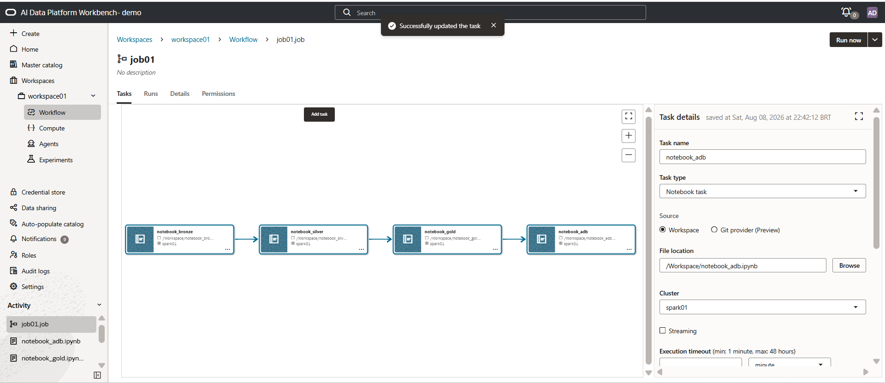

Ejecute el workflow, siga su avance y valide los resultados de cada actividad en la pestaña run.

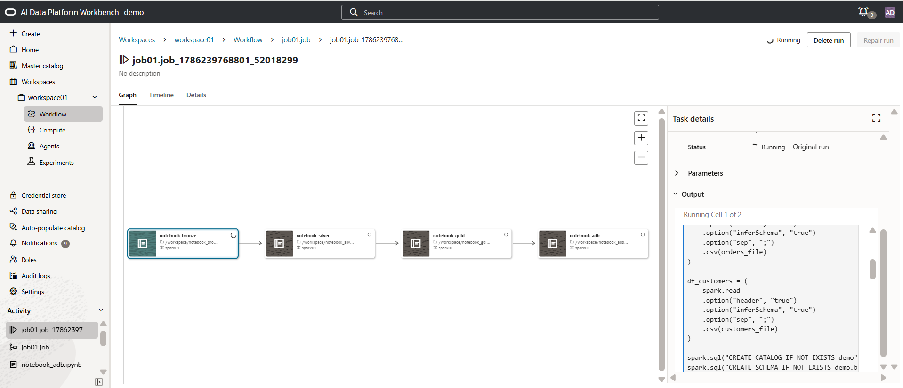

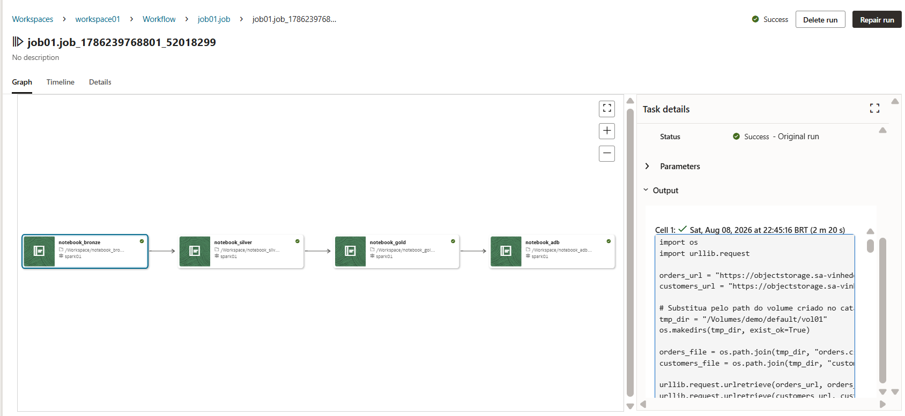

Si desea programar la ejecución del workflow, puede hacerlo desde la pestaña de configuración del job mediante **Details** y **Schedule**. También puede invocar el job mediante API y SDK.


## **7️⃣ Creación de agents**

Una vez cargados los conjuntos de datos en AIDP, podemos crear agents fácilmente. Nuestro agent responderá preguntas sobre los clientes de la base procesada y la política de devolución de productos.

Primero, habilite el uso de agents en la instancia de AIDP. En la página principal de AIDP, haga clic en el panel izquierdo y, en la pantalla enable AI Features, utilice la base de datos creada anteriormente para habilitar esta funcionalidad.

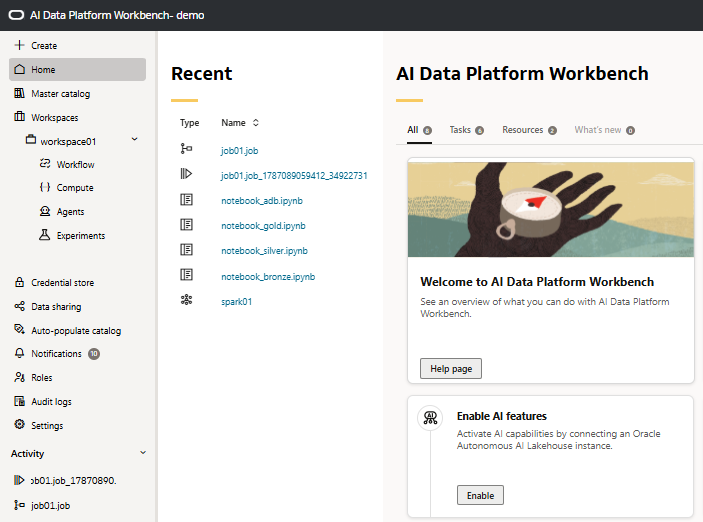

Ahora crearemos la knowledge base. En el panel izquierdo, haga clic en Master Catalog y luego en el catálogo demo.


A continuación, haga clic en default y luego en knowledge bases; use el botón + junto al buscador para crear la knowledge base.

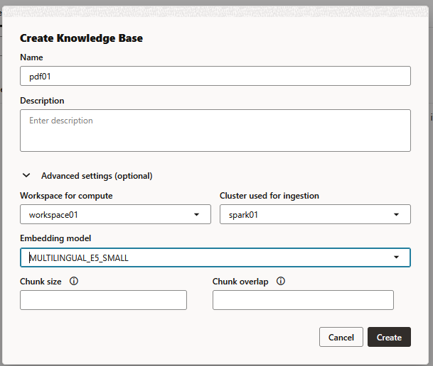

Dentro de la knowledge base pdf01, haga clic en el botón + (junto al filtro) y agregue vol01, como se muestra en la imagen.

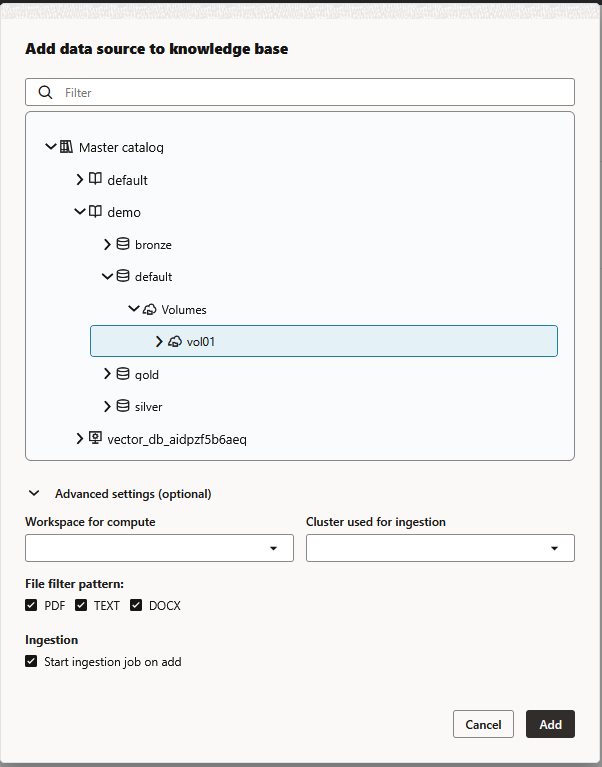

Después de crear la knowledge base, continúe con la creación del agent. En el panel izquierdo de su workspace, haga clic en agents y luego en el botón + junto al campo de filtro.


Asigne el nombre agent01 y haga clic en crear.

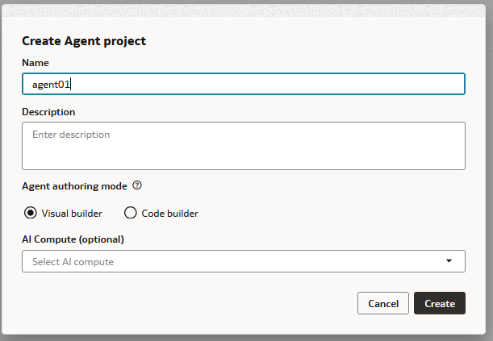

En la esquina superior derecha, haga clic en Create a new AI Compute. Deje que se cree mientras continúa con el workshop.

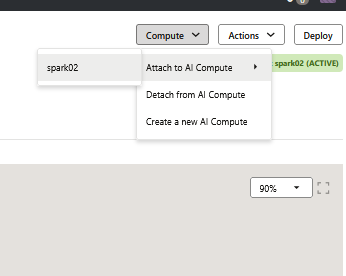

Arrastre los componentes Chat trigger y executor agent al lienzo. También arrastre las tools de SQL y RAG; conecte los componentes como se muestra a continuación.

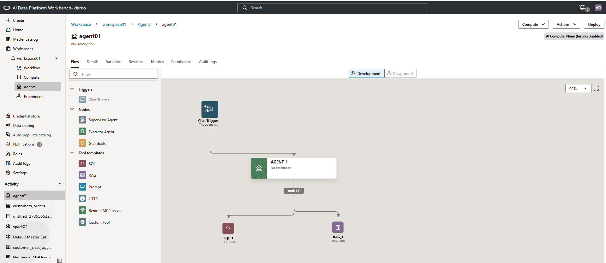

Haga clic en el agent (ícono verde) y configúrelo como se indica.

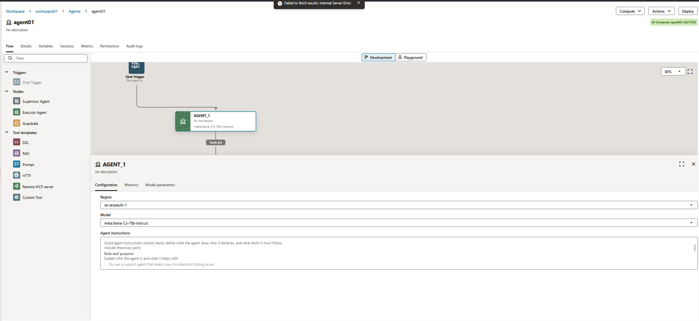

Haga clic en sql_1 (ícono marrón) y configúrelo como se indica (la query aparece debajo de la captura).

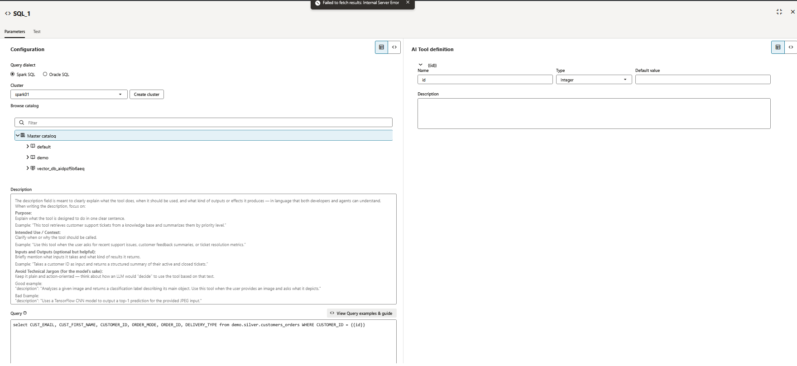

``` sql
select CUST_EMAIL, CUST_FIRST_NAME, CUSTOMER_ID, ORDER_MODE, ORDER_ID, DELIVERY_TYPE from demo.silver.customers_orders WHERE CUSTOMER_ID = {{id}}
```

Haga clic en rag_1 (ícono morado) y configúrelo como se indica.


Al finalizar la configuración, adjunte AI Compute y haga clic en el ícono playground de la parte superior de la pantalla.

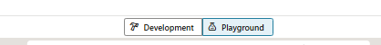

En la esquina inferior izquierda, escriba las preguntas de prueba para el agent:
- ¿cuáles son las formas de reembolso para mi pedido?
- ¿cuál es el correo electrónico del usuario con el id 749998?


Ahora haga clic en deploy, en la esquina superior derecha.

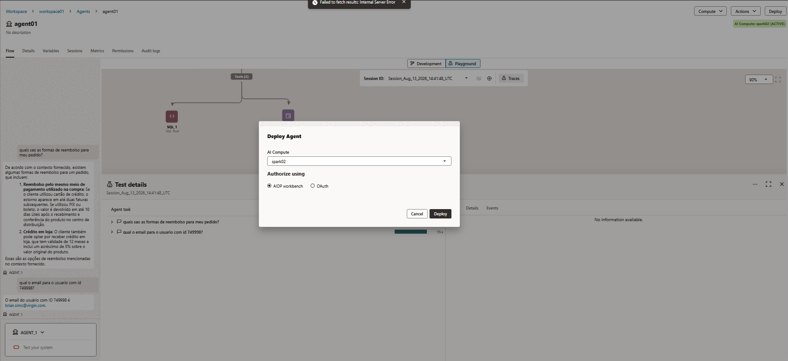

Cuando finalice el despliegue, haga clic en details para ver las URL de integración.

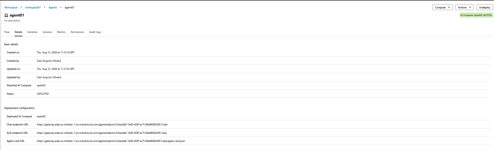

En sessions puede ver las sesiones activas y el uso de tokens.

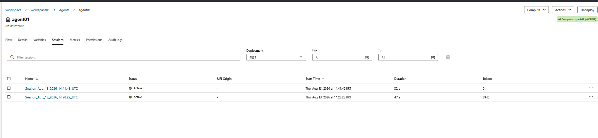

En métricas puede obtener una vista general del entorno.


------------------------------------------------------------------------

## **✅ Laboratorio finalizado**

¡Felicitaciones! Completó la práctica guiada de **OCI AI Data Platform (AIDP)**: construyó las capas **Bronze**, **Silver** y **Gold**, orquestó las actividades mediante un **Workflow** y creó un agent sencillo sobre los datos procesados.


## 👥 Agradecimientos

- **Autor** - Caio Oliveira
- **Autora colaboradora** - Isabelle Anjos
- **Última actualización** - Agosto de 2026

## 🛡️ Declaración de puerto seguro (Safe Harbor)

El tutorial presentado tiene por objeto describir la dirección general de nuestros productos. Se ofrece únicamente con fines informativos y no puede incorporarse a un contrato. No constituye un compromiso de entrega de ningún material, código o funcionalidad, ni debe considerarse para decisiones de compra. El desarrollo, lanzamiento, fecha de disponibilidad y precio de las funcionalidades o recursos de los productos Oracle descritos están sujetos a cambios y son de exclusiva discreción de Oracle Corporation.

Esta es una traducción de cortesía de una presentación en inglés preparada para la sede de Oracle en Estados Unidos, por lo que puede contener errores. Los recursos y funcionalidades podrían no estar disponibles en todos los países e idiomas. Ante cualquier duda, contacte a su representante de ventas de Oracle.
