# Oracle AI Database 26ai

## 🎯 **Objetivos**

Demostrar en la práctica cómo utilizar algunas funcionalidades de Oracle AI Database 26ai para atender cargas de trabajo de Data Warehouse.

Aprenderá a:

- Crear y configurar nuevos esquemas y usuarios en Oracle AI Database 26ai.
- Realizar y orquestar transformaciones mediante procedures y Oracle Scheduler.
- Importar y configurar una aplicación de Select AI.
- Configurar y probar Data Redaction.
- Configurar ORDS para consultar conjuntos de datos.

<aside class="workshop-alert" role="note" aria-label="Atención">
  <svg class="workshop-alert-icon" viewBox="0 0 24 24" fill="none" aria-hidden="true" focusable="false">
    <path fill-rule="evenodd" clip-rule="evenodd" d="M11 13C11 13.5523 11.4477 14 12 14C12.5523 14 13 13.5523 13 13V10C13 9.44772 12.5523 9 12 9C11.4477 9 11 9.44772 11 10V13ZM13 15.9888C13 15.4365 12.5523 14.9888 12 14.9888C11.4477 14.9888 11 15.4365 11 15.9888V16C11 16.5523 11.4477 17 12 17C12.5523 17 13 16.5523 13 16V15.9888ZM9.37735 4.66136C10.5204 2.60393 13.4793 2.60393 14.6223 4.66136L21.2233 16.5431C22.3341 18.5427 20.8882 21 18.6008 21H5.39885C3.11139 21 1.66549 18.5427 2.77637 16.5431L9.37735 4.66136Z" fill="currentColor" />
  </svg>
  <div class="workshop-alert-copy">
    <strong>Atención.</strong>
    <p>Recomendamos completar primero la práctica guiada de AI Data Platform Workbench.</p>
  </div>
</aside>

### _**Disfrute su experiencia en Oracle Cloud.**_

## 📌 Introducción

Esta práctica guiada muestra cómo Oracle AI Database 26ai puede complementar AI Data Platform, aportando capacidades para atender cargas de trabajo de Data Warehouse de forma integrada, segura y automatizada. A lo largo del workshop aprenderá a crear y configurar esquemas y usuarios; realizar y orquestar transformaciones de datos con procedures y Oracle Scheduler; importar y configurar aplicaciones con Select AI; implementar Data Redaction para proteger información sensible, y configurar ORDS para publicar consultas sobre conjuntos de datos. El objetivo es brindar experiencia práctica con funcionalidades esenciales de Oracle AI Database 26ai en Oracle Cloud.

## **1️⃣ Creación del esquema y preparación del entorno**

Utilice la instancia de Oracle AI Database 26ai creada en la práctica guiada de OCI AI Data Platform.


Haga clic en **Database Users**.

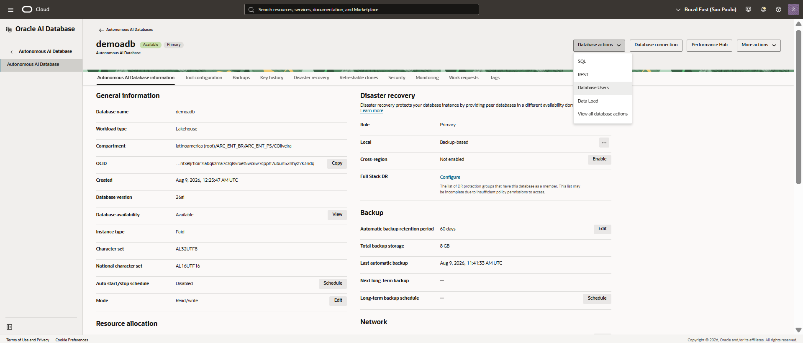

Haga clic en **+ Crear usuario**, cree el usuario `AI` y conceda los grants como se muestra en la captura de pantalla.

<aside class="workshop-alert" role="note" aria-label="Atención">
  <svg class="workshop-alert-icon" viewBox="0 0 24 24" fill="none" aria-hidden="true" focusable="false">
    <path fill-rule="evenodd" clip-rule="evenodd" d="M11 13C11 13.5523 11.4477 14 12 14C12.5523 14 13 13.5523 13 13V10C13 9.44772 12.5523 9 12 9C11.4477 9 11 9.44772 11 10V13ZM13 15.9888C13 15.4365 12.5523 14.9888 12 14.9888C11.4477 14.9888 11 15.4365 11 15.9888V16C11 16.5523 11.4477 17 12 17C12.5523 17 13 16.5523 13 16V15.9888ZM9.37735 4.66136C10.5204 2.60393 13.4793 2.60393 14.6223 4.66136L21.2233 16.5431C22.3341 18.5427 20.8882 21 18.6008 21H5.39885C3.11139 21 1.66549 18.5427 2.77637 16.5431L9.37735 4.66136Z" fill="currentColor" />
  </svg>
  <div class="workshop-alert-copy">
    <strong>Atención.</strong>
    <p>Se sugiere utilizar la contraseña <strong>WORKSHOPsec2019##</strong>; no obstante, puede elegir otra si lo desea. Para las demás configuraciones, puede usar los valores predeterminados y hacer clic en <strong>Create</strong>.</p>
  </div>
</aside>

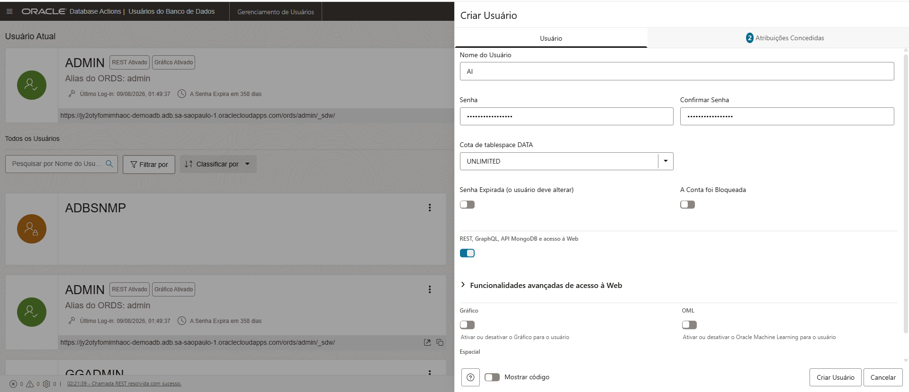

## **2️⃣ Configurar y orquestar transformaciones con procedures y Oracle Scheduler**

En el menú de la esquina superior izquierda, haga clic en **SQL**.


Si completó correctamente el laboratorio de AI Data Platform, verá los dos conjuntos de datos replicados: `CUSTOMERS_ORDERS` y `CUSTOMER_CLASS_AGG_REVIEW`.


Haga clic y arrastre el conjunto de datos `CUSTOMERS_ORDERS` al centro de la pantalla, seleccione la casilla **Seleccionar** y haga clic en **Aplicar**.


Cambie el grupo de consumidores a **medium**.

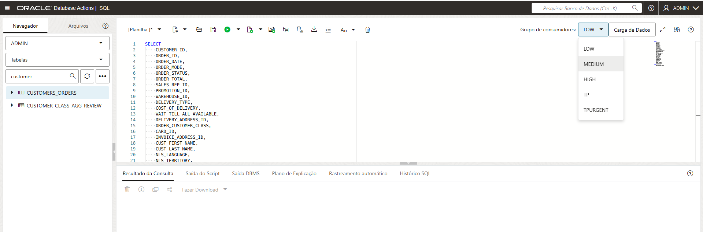

Haga clic en el centro de la pantalla y presione **Ctrl + Enter** para ejecutar la query.

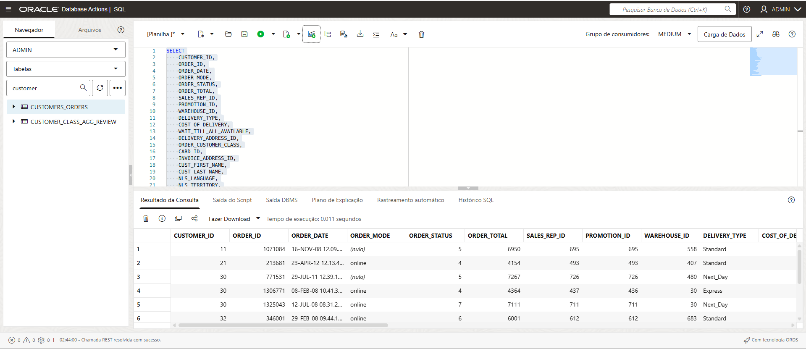

Haga clic con el botón derecho en el conjunto de datos y elija **Abrir**.

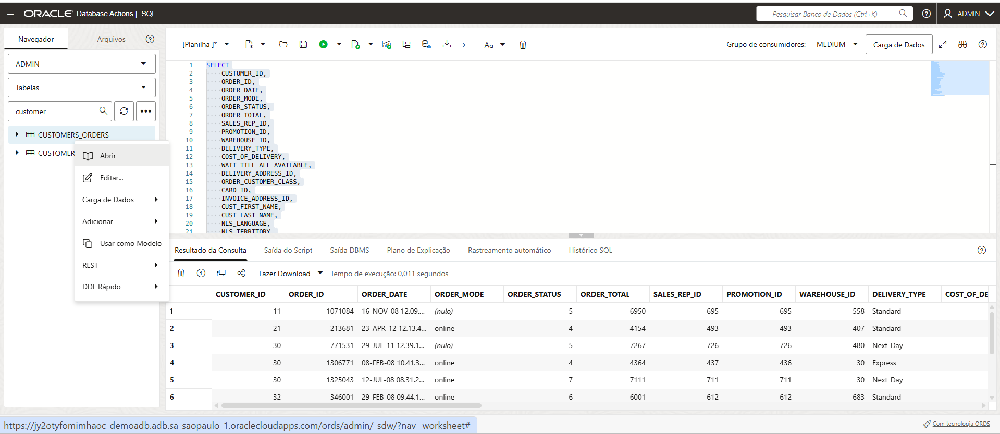

Examine los datos, consulte los metadatos del objeto y haga clic en **Cerrar**.


De regreso en el worksheet, conceda grants adicionales al usuario `AI`. Copie, pegue y ejecute el bloque siguiente presionando **F5**.

``` sql
GRANT dwrole TO ai;
GRANT unlimited tablespace TO ai;
GRANT READ, WRITE ON DIRECTORY data_pump_dir TO ai;
GRANT EXECUTE ON DBMS_CLOUD TO ai;
GRANT CREATE PROPERTY GRAPH TO ai;
GRANT EXECUTE ON DBMS_LOCK TO ai;
GRANT EXECUTE ON DBMS_CLOUD_AI TO ai;
GRANT EXECUTE ON SYS.DBMS_REDACT TO AI;
GRANT ADMINISTER REDACTION POLICY TO AI;

BEGIN
  DBMS_NETWORK_ACL_ADMIN.APPEND_HOST_ACE(
    host => '*',
    ace => xs$ace_type(privilege_list => xs$name_list('connect'),
                       principal_name => 'ai',
                       principal_type => xs_acl.ptype_db));
END;
/ 
```

Ahora cree y pruebe la procedure de replicación de los conjuntos de datos. El objetivo es replicar las tablas `CUSTOMERS_ORDERS` y `CUSTOMER_CLASS_AGG_REVIEW` del esquema `ADMIN` al esquema `AI`.

Cree y pruebe la procedure de replicación de los conjuntos de datos.

``` sql
CREATE OR REPLACE PROCEDURE ADMIN.REFRESH_AI_TABLES
AS
BEGIN
    -- Drop AI.CUSTOMER_ORDERS if it exists
    BEGIN
        EXECUTE IMMEDIATE 'DROP TABLE AI.CUSTOMERS_ORDERS PURGE';
    EXCEPTION
        WHEN OTHERS THEN
            IF SQLCODE != -942 THEN
                RAISE;
            END IF;
    END;

    -- Recreate AI.CUSTOMER_ORDERS
    EXECUTE IMMEDIATE '
        CREATE TABLE AI.CUSTOMERS_ORDERS AS
        SELECT *
        FROM ADMIN.CUSTOMERS_ORDERS
    ';

    -- Drop AI.CUSTOMER_CLASS_AGG_REVIEW if it exists
    BEGIN
        EXECUTE IMMEDIATE 'DROP TABLE AI.CUSTOMER_CLASS_AGG_REVIEW PURGE';
    EXCEPTION
        WHEN OTHERS THEN
            IF SQLCODE != -942 THEN
                RAISE;
            END IF;
    END;

    -- Recreate AI.CUSTOMER_CLASS_AGG_REVIEW
    EXECUTE IMMEDIATE '
        CREATE TABLE AI.CUSTOMER_CLASS_AGG_REVIEW AS
        SELECT *
        FROM ADMIN.CUSTOMER_CLASS_AGG_REVIEW
    ';

END REFRESH_AI_TABLES;
/
```

``` sql
BEGIN
    ADMIN.REFRESH_AI_TABLES;
END;
/
```


Ahora haga clic en el ícono de la esquina superior izquierda y seleccione **Programación**.

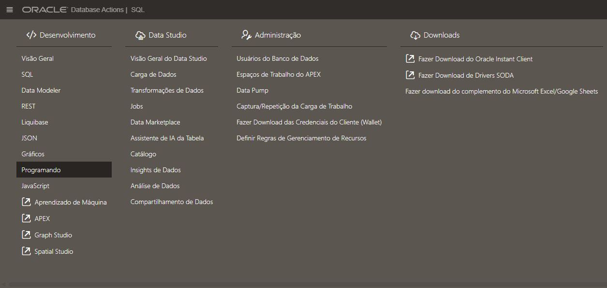

Haga clic en + Crear job, asígnele el nombre AI_Refresh, seleccione la clase sys.medium y pegue el bloque siguiente.

``` sql
BEGIN
    ADMIN.REFRESH_AI_TABLES;
END;
```
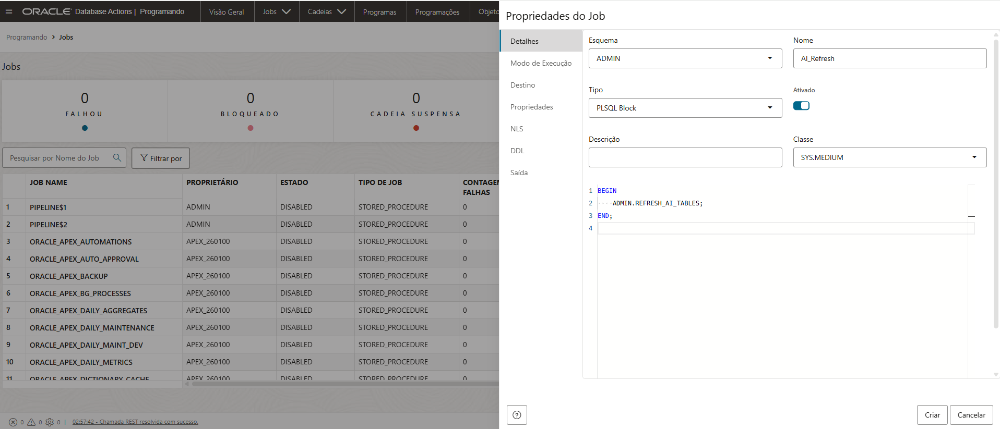

En la pestaña **Modo de ejecución**, configure la procedure para que se ejecute cada hora y haga clic en **Crear**.


Ejecute el job.

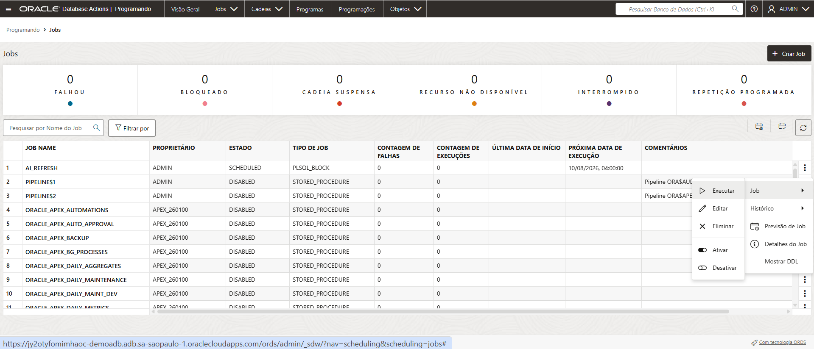

Cuando termine, haga clic en la pestaña de historial y reporte para obtener una vista completa de las ejecuciones y posibles errores.


## **3️⃣ Importar y configurar la aplicación Select AI**

Haga clic en el ícono de la esquina superior izquierda y seleccione apex. Inicie sesión de nuevo con el usuario ADMIN y la contraseña configurada al crear Oracle AI Database 26ai.

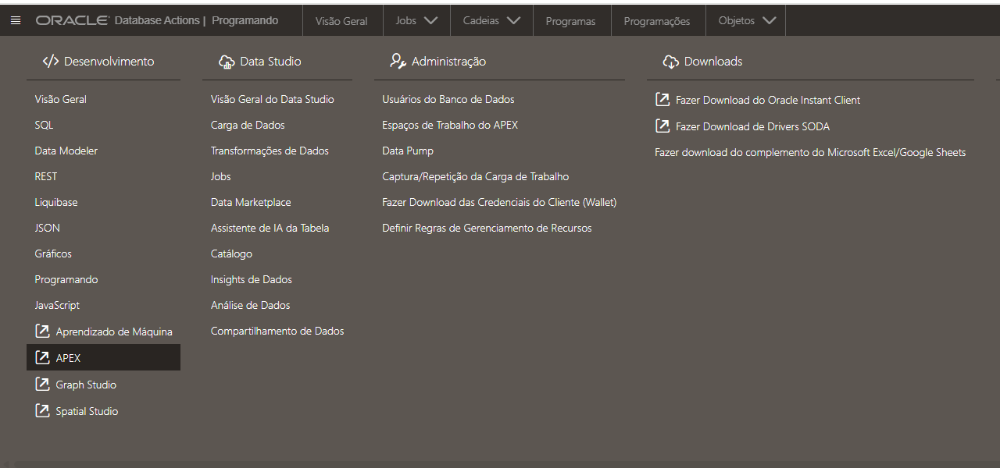

Haga clic en el ícono create workspace de la esquina derecha de la pantalla y seleccione existing schema.


Seleccione el esquema AI e ingrese la contraseña del entorno. Recomendamos la contraseña mostrada en la captura; haga clic en create workspace.


En la parte inferior izquierda de la pantalla, cierre la sesión del entorno.


En la pantalla de inicio de sesión, ingrese con el usuario AI y la contraseña configurada en la etapa anterior.

A continuación, haga clic en SQL Workshop y SQL Commands.


Copie y pegue el siguiente código (nota: deberá ajustar la sección create_credential según los identificadores y la configuración de su entorno).

``` sql
BEGIN
   DBMS_CLOUD.CREATE_CREDENTIAL (
       credential_name => 'OBJ_STORE_CRED',
       user_ocid       => 'USER_OCID',
       tenancy_ocid    => 'TENANCY_OCID',
       private_key     => 'PRIVATE_KEY_SEM_CABEÇALHO_RODAPÉ',
       fingerprint     => 'FINGERPRINT_CHAVE');
END;
/

begin
   dbms_cloud_ai.create_profile(
    profile_name => 'OCI_GENAI',
    attributes   => '{"provider": "oci",
        "model":"meta.llama-3.3-70b-instruct" ,
        "credential_name": "OBJ_STORE_CRED",
        "object_list": [
            {"owner": "AI"}
            ],
        "region": "sa-saopaulo-1",
        "comments":"true"
    }'
   );
end;
/   
```

La información para dbms_cloud.create_credential se puede obtener en la pestaña de configuración de su usuario de OCI.


En la pestaña token and keys, cree una API Key, descargue la clave privada y haga clic en view configuration file, en la esquina derecha.


A continuación se muestra un ejemplo de cómo completar el código que se debe ejecutar dentro de apex.


Ahora agregaremos comentarios a la tabla CUSTOMERS_ORDERS para facilitar el uso de Select AI. En apex, haga clic en sql scripts.

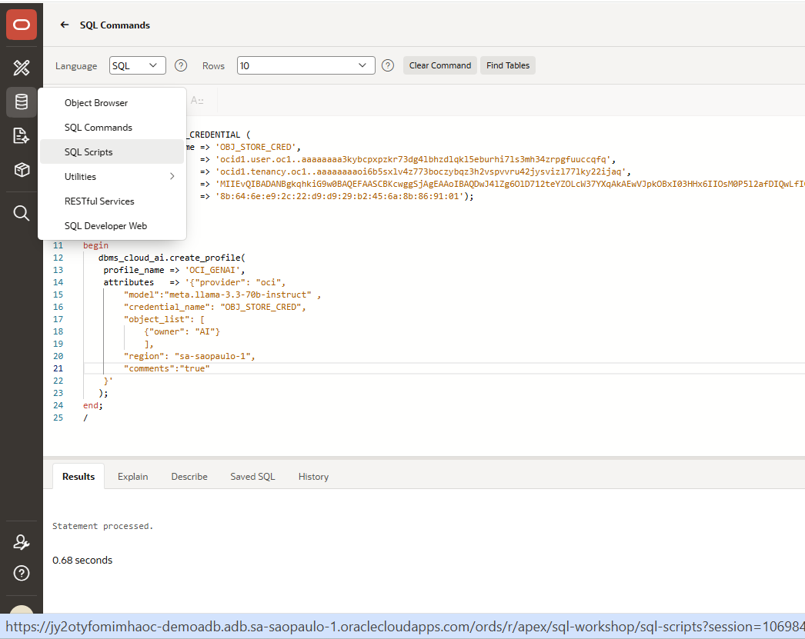

Haga clic en create y pegue el siguiente código. Asígnele el nombre comentarios_tabela y luego haga clic en run.

``` sql
COMMENT ON TABLE AI.CUSTOMERS_ORDERS IS
'Tabela de pedidos e perfil de clientes usada para análises, segmentação e geração de consultas em linguagem natural no Select AI.';

COMMENT ON COLUMN AI.CUSTOMERS_ORDERS.CUSTOMER_ID IS
'Identificador único do cliente.';

COMMENT ON COLUMN AI.CUSTOMERS_ORDERS.ORDER_ID IS
'Identificador único do pedido.';

COMMENT ON COLUMN AI.CUSTOMERS_ORDERS.ORDER_DATE IS
'Data do pedido armazenada como texto.';

COMMENT ON COLUMN AI.CUSTOMERS_ORDERS.ORDER_MODE IS
'Canal ou modo de realização do pedido, como online, loja ou outro canal.';

COMMENT ON COLUMN AI.CUSTOMERS_ORDERS.ORDER_STATUS IS
'Status numérico do pedido.';

COMMENT ON COLUMN AI.CUSTOMERS_ORDERS.ORDER_TOTAL IS
'Valor total do pedido.';

COMMENT ON COLUMN AI.CUSTOMERS_ORDERS.SALES_REP_ID IS
'Identificador do representante de vendas responsável pelo pedido.';

COMMENT ON COLUMN AI.CUSTOMERS_ORDERS.PROMOTION_ID IS
'Identificador da promoção aplicada ao pedido.';

COMMENT ON COLUMN AI.CUSTOMERS_ORDERS.WAREHOUSE_ID IS
'Identificador do armazém ou centro de distribuição responsável pelo pedido.';

COMMENT ON COLUMN AI.CUSTOMERS_ORDERS.DELIVERY_TYPE IS
'Tipo de entrega selecionado para o pedido.';

COMMENT ON COLUMN AI.CUSTOMERS_ORDERS.COST_OF_DELIVERY IS
'Custo de entrega do pedido.';

COMMENT ON COLUMN AI.CUSTOMERS_ORDERS.WAIT_TILL_ALL_AVAILABLE IS
'Indica se o pedido aguarda todos os itens ficarem disponíveis antes do envio.';

COMMENT ON COLUMN AI.CUSTOMERS_ORDERS.DELIVERY_ADDRESS_ID IS
'Identificador do endereço de entrega.';

COMMENT ON COLUMN AI.CUSTOMERS_ORDERS.ORDER_CUSTOMER_CLASS IS
'Classe ou segmento do cliente no contexto do pedido.';

COMMENT ON COLUMN AI.CUSTOMERS_ORDERS.CARD_ID IS
'Identificador do cartão utilizado no pedido.';

COMMENT ON COLUMN AI.CUSTOMERS_ORDERS.INVOICE_ADDRESS_ID IS
'Identificador do endereço de cobrança ou faturamento.';

COMMENT ON COLUMN AI.CUSTOMERS_ORDERS.CUST_FIRST_NAME IS
'Primeiro nome do cliente.';

COMMENT ON COLUMN AI.CUSTOMERS_ORDERS.CUST_LAST_NAME IS
'Sobrenome do cliente.';

COMMENT ON COLUMN AI.CUSTOMERS_ORDERS.NLS_LANGUAGE IS
'Idioma preferencial do cliente.';

COMMENT ON COLUMN AI.CUSTOMERS_ORDERS.NLS_TERRITORY IS
'Território ou região preferencial do cliente.';

COMMENT ON COLUMN AI.CUSTOMERS_ORDERS.CREDIT_LIMIT IS
'Limite de crédito do cliente.';

COMMENT ON COLUMN AI.CUSTOMERS_ORDERS.CUST_EMAIL IS
'Endereço de e-mail do cliente.';

COMMENT ON COLUMN AI.CUSTOMERS_ORDERS.ACCOUNT_MGR_ID IS
'Identificador do gerente de conta responsável pelo cliente.';

COMMENT ON COLUMN AI.CUSTOMERS_ORDERS.CUSTOMER_SINCE IS
'Data desde quando o cliente está cadastrado, armazenada como texto.';

COMMENT ON COLUMN AI.CUSTOMERS_ORDERS.CUSTOMER_CLASS IS
'Classe ou segmento principal do cliente.';

COMMENT ON COLUMN AI.CUSTOMERS_ORDERS.SUGGESTIONS IS
'Sugestões ou recomendações associadas ao cliente.';

COMMENT ON COLUMN AI.CUSTOMERS_ORDERS.DOB IS
'Data de nascimento do cliente armazenada como texto.';

COMMENT ON COLUMN AI.CUSTOMERS_ORDERS.MAILSHOT IS
'Indica se o cliente aceita receber campanhas de marketing por e-mail.';

COMMENT ON COLUMN AI.CUSTOMERS_ORDERS.PARTNER_MAILSHOT IS
'Indica se o cliente aceita receber campanhas de parceiros.';

COMMENT ON COLUMN AI.CUSTOMERS_ORDERS.PREFERRED_ADDRESS IS
'Identificador do endereço preferido do cliente.';

COMMENT ON COLUMN AI.CUSTOMERS_ORDERS.PREFERRED_CARD IS
'Identificador do cartão preferido do cliente.';  
```

Cuando termine la configuración, haga clic en App builder y después en import.

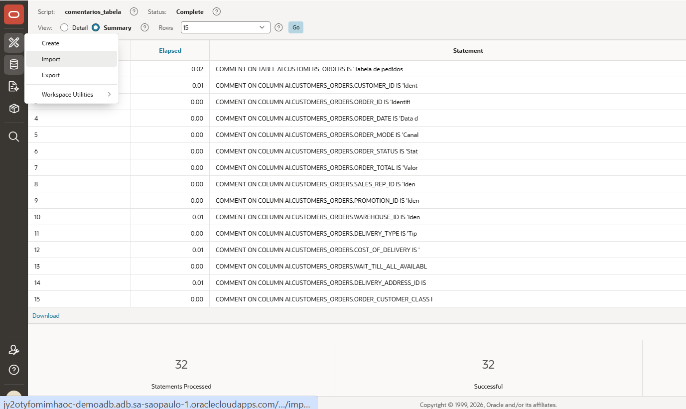

Descargue el archivo https://raw.githubusercontent.com/caiogusto2/workshop-dataplatform/main/autonomousdb/app_apex/selectai.zip y cárguelo en el formulario. Haga clic en next, luego en import application, next, install supporting objects y, por último, run application.


El usuario será AI y la contraseña será WORKSHOPsec2019##.


Seleccione `OCI_GENAI` y haga clic en la x.


Pregunte: ¿cuál es la cantidad de pedidos por delivery_type?

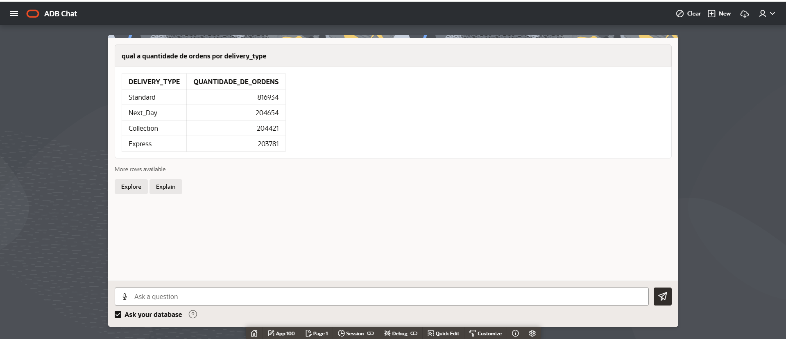

Otras preguntas que puede realizar:
- ¿cuál es la cantidad de pedidos por customer_class?
- ¿cuáles son los pedidos realizados con el correo alfred.foley@yahoo.com?
- ¿cuál es la cantidad de pedidos por warehouse_id?

## **4️⃣ Configurar y probar ORDS**

De regreso en apex, primero configuraremos Data Redaction para la columna de correo electrónico de la tabla CUSTOMERS_ORDERS. Haga clic en SQL Commands.


Copie y pegue el comando siguiente.

``` sql
BEGIN
  DBMS_REDACT.ADD_POLICY(
    object_schema  => 'AI',
    object_name    => 'CUSTOMERS_ORDERS',
    policy_name    => 'REDACT_CUST_EMAIL_ORDS',
    column_name    => 'CUST_EMAIL',
    function_type  => DBMS_REDACT.FULL,
    expression     => 'SYS_CONTEXT(''USERENV'',''MODULE'') = ''/v1/consulta'''
  );
END;
/
```

Realice una prueba y compruebe que, al iniciar sesión con el usuario AI, tiene acceso completo al conjunto de datos.

``` sql
select cust_first_name, cust_last_name, cust_email from customers_orders;
```

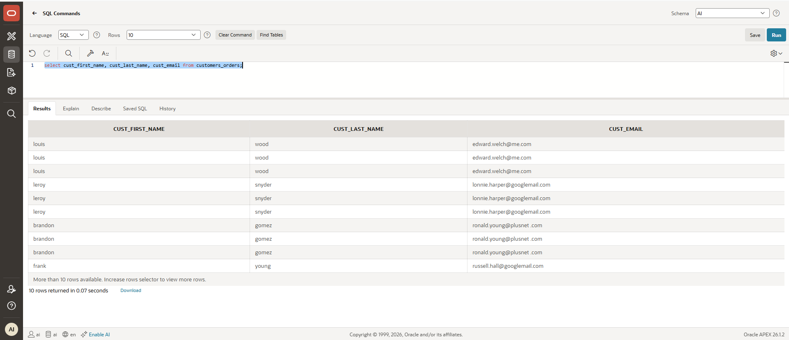

Ahora haga clic en la pestaña RESTful Services.

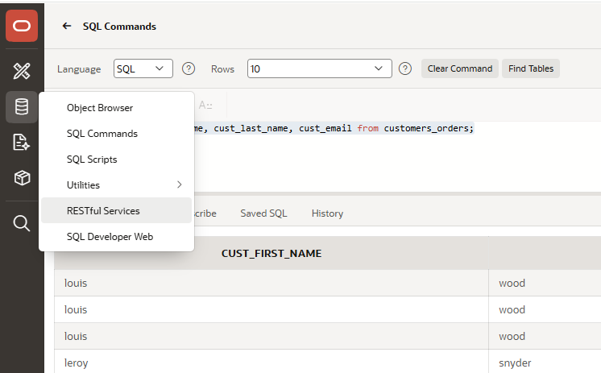

Haga clic en Modules > create module, asigne el nombre api y el base path v1.


A continuación, haga clic en create template y escriba consulta en uri template.


A continuación, cree un handler y escriba lo siguiente en source:

``` sql
select cust_first_name, cust_last_name, cust_email from customers_orders
```


Copie y pegue la URL en el navegador web. Verá los datos, pero el correo electrónico aparecerá nulo debido a la regla de redacción.

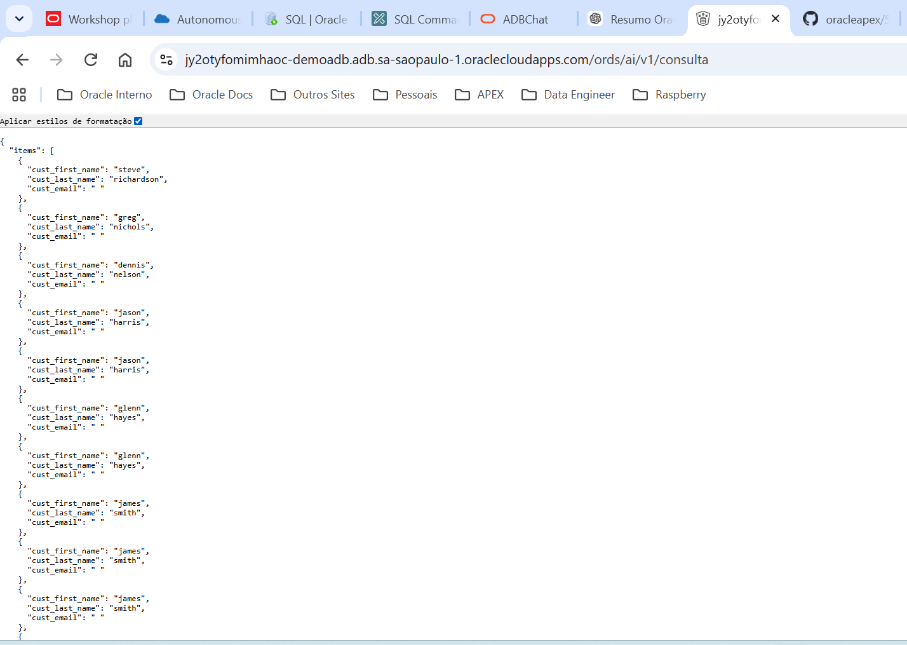

## **✅ Laboratorio finalizado**

¡Felicitaciones! Completó la práctica guiada de **Oracle AI Database 26ai**. Aprendió a usar las tablas cargadas por AI Data Platform para orquestar y realizar otras transformaciones con procedures y scheduler, importó y configuró una aplicación apex que demuestra el uso de Select AI y, finalmente, creó un endpoint REST con una regla de redacción.


## 👥 Agradecimientos

- **Autor** - Caio Oliveira
- **Autora colaboradora** - Isabelle Anjos
- **Última actualización** - Agosto de 2026

## 🛡️ Safe Harbor

El tutorial presentado tiene por objeto describir la dirección general de nuestros productos. Se ofrece únicamente con fines informativos y no puede incorporarse a un contrato. No constituye un compromiso de entrega de ningún material, código o funcionalidad, ni debe considerarse para decisiones de compra. El desarrollo, lanzamiento, fecha de disponibilidad y precio de las funcionalidades o recursos de los productos Oracle descritos están sujetos a cambios y son de exclusiva discreción de Oracle Corporation.

Esta es una traducción de cortesía de una presentación en inglés preparada para la sede de Oracle en Estados Unidos, por lo que puede contener errores. Los recursos y funcionalidades podrían no estar disponibles en todos los países e idiomas. Ante cualquier duda, contacte a su representante de ventas de Oracle.
